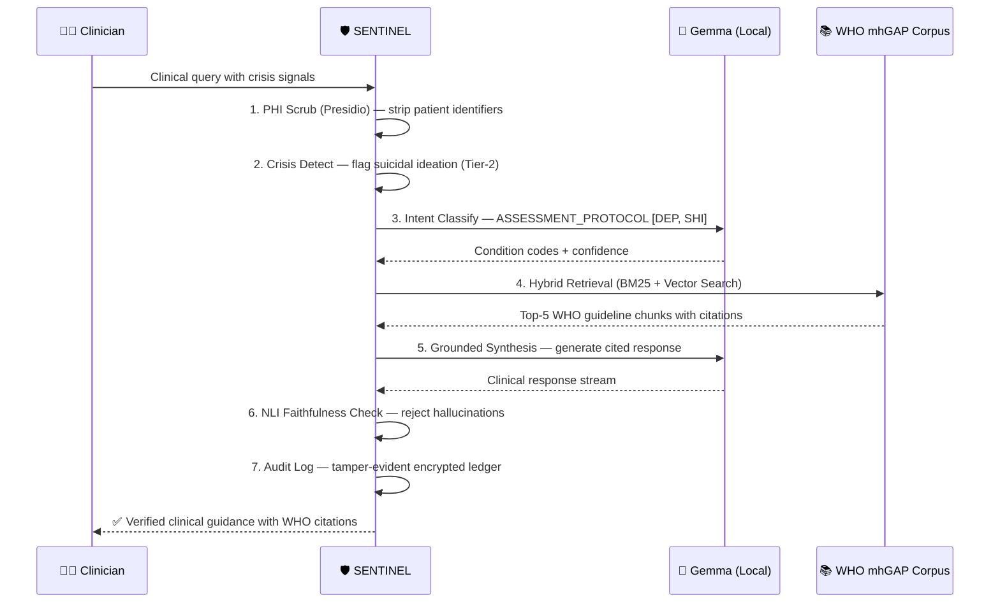
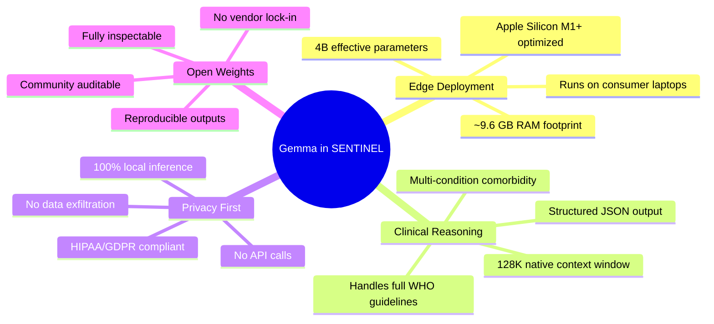
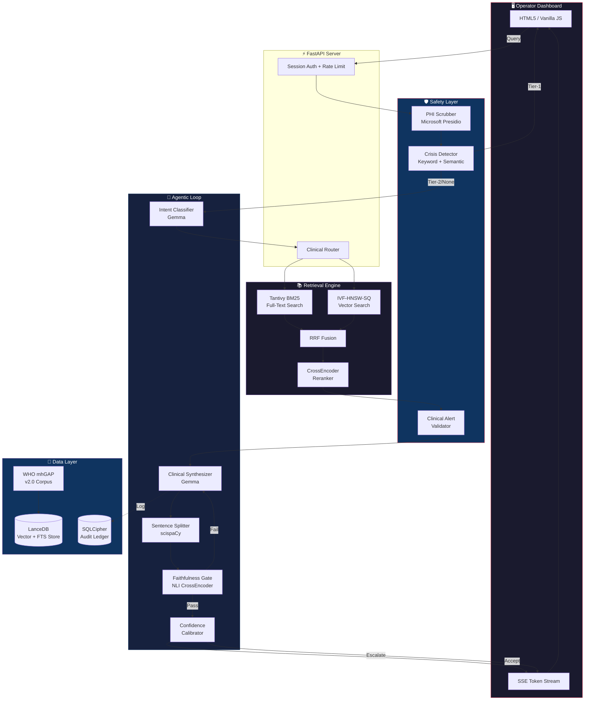
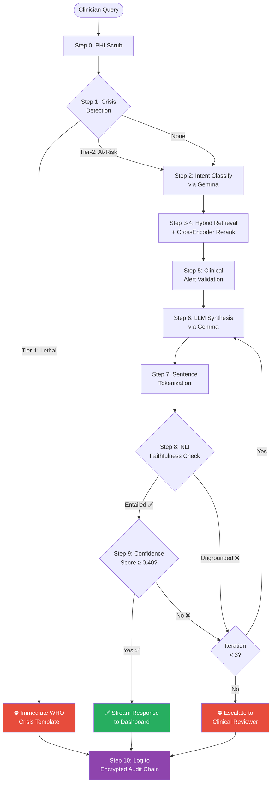

<p align="center">
  <h1 align="center">🛡 SENTINEL</h1>
  <p align="center"><strong>Edge-Native Clinical Intelligence for Mental Health</strong></p>
  <p align="center">
    <em>WHO mhGAP Agentic Consultation System · Powered by Gemma · 100% Offline</em>
  </p>
</p>

<p align="center">
  <a href="#-quick-start"></a>
  <a href="#-architecture"></a>
  <a href="#-why-gemma"></a>
  <a href="LICENSE"></a>
</p>

---

> [!IMPORTANT]
> **100% Air-Gapped Operation.** SENTINEL runs entirely on local edge hardware — no cloud APIs, zero network traffic, full HIPAA/GDPR compliance. Patient data never leaves the device.

---

## 🌍 The Problem

In remote clinics, disaster zones, and air-gapped hospital networks, mental health workers rely on the **WHO mhGAP Intervention Guide** — a 200+ page clinical manual — to assess and manage conditions like depression, psychosis, and suicidal risk.

**Current solutions fail these environments:**

| Challenge | Why Existing Tools Fail |
|-----------|------------------------|
| **No Internet** | Cloud AI (ChatGPT, Gemini API) requires connectivity |
| **Patient Privacy** | Sending patient data to third-party APIs violates HIPAA/GDPR |
| **Clinical Safety** | Default RAG pipelines hallucinate treatment advice |
| **Accountability** | No audit trail for AI-assisted clinical decisions |

---

## ✨ What SENTINEL Does

A primary care worker in a remote clinic types:

> *"Patient is 34F, two weeks of low mood, poor sleep, stopped eating. Mentions she sometimes thinks about not wanting to be here anymore. What does mhGAP say?"*

**SENTINEL processes this entirely offline, on a laptop, in under 30 seconds:**



**Result:** A grounded, cited clinical response with crisis protocol alerts, verified against WHO text, logged to an encrypted audit chain.

---

## 🤖 Why Gemma?

SENTINEL is built around **Google's Gemma** model family, running locally via [Ollama](https://ollama.ai). Gemma is the critical enabler for edge-native clinical AI.

### The Gemma Advantage for Clinical Edge AI



### How Gemma Powers Each Pipeline Stage

| Stage | Gemma's Role | Why It Matters |
|-------|-------------|----------------|
| **Intent Classification** | Classifies clinical queries into 9 mhGAP intent types (assessment, treatment, medication, referral, crisis, etc.) and maps to WHO condition codes (DEP, PSY, SHI, EPI, etc.) | Structured JSON output with confidence scores enables deterministic routing — no regex fallback needed |
| **Clinical Synthesis** | Generates grounded responses strictly from retrieved WHO context, with inline citations to section paths and page numbers | 128K context window fits the full retrieved context + session history + safety prompts without truncation |
| **Refinement Loop** | When NLI detects ungrounded claims, Gemma rewrites the response using explicit feedback about which sentences failed verification | Self-correction capability reduces hallucination without human intervention |
| **Embedding Generation** | `nomic-embed-text` (via Ollama) generates 768-dim embeddings for both corpus chunks and queries | Unified local inference stack — no separate embedding service needed |

### Why Not Cloud APIs?

```
Cloud AI:  Clinician → Internet → API → Response → Internet → Clinician
           ❌ Requires connectivity  ❌ Patient data leaves device  ❌ No audit control

SENTINEL:  Clinician → Gemma (local) → Response
           ✅ Works offline  ✅ Data stays on device  ✅ Full audit chain
```

**Gemma's 4B-effective footprint means a single laptop can run the entire clinical AI stack** — LLM inference, embedding generation, and intent classification — without a GPU server or cloud subscription.

---

## 🏗 Architecture

### System Overview



### Agentic Reasoning Loop

The core of SENTINEL is a **self-correcting agentic loop** that iterates until the response passes all safety and faithfulness gates:



---

## 🧰 Tech Stack

| Component | Technology | Purpose |
|-----------|-----------|---------|
| **LLM Engine** | **Gemma 4 (e4b)** via Ollama | Clinical reasoning, intent classification, grounded synthesis |
| **Embeddings** | **nomic-embed-text** via Ollama | 768-dim semantic embeddings for vector search |
| **Vector Store** | **LanceDB** | Single-file vector + full-text search (Tantivy BM25 + IVF-HNSW-SQ) |
| **Faithfulness** | **NLI MiniLM** CrossEncoder | Sentence-level entailment verification against WHO source text |
| **Reranker** | **ms-marco-MiniLM** CrossEncoder | Cross-encoder relevance reranking of retrieved chunks |
| **PHI Scrubbing** | **Microsoft Presidio** | Offline PII/PHI detection and anonymization |
| **Sentence Splitting** | **scispaCy** + NLTK fallback | Medical-abbreviation-aware sentence tokenization |
| **Document Parsing** | **Docling** | Layout-aware PDF ingestion with decision tree extraction |
| **Audit Chain** | **SQLCipher** + Ed25519 + SHA-256 | Tamper-evident, encrypted audit ledger |
| **API Server** | **FastAPI** + SSE + slowapi | Local-only server with rate limiting and token streaming |
| **Dashboard** | **Vanilla HTML5/CSS/JS** | Zero-dependency operator UI, WCAG 2.1 AA accessible |

---

## ⚡ Quick Start

### Prerequisites

- **OS:** macOS (Apple Silicon recommended) or Linux
- **RAM:** 16 GB minimum (Gemma 4 e4b requires ~9.6 GB)
- **Ollama:** [Install Ollama](https://ollama.ai)
- **Python:** 3.11+
- **uv:** `curl -LsSf https://astral.sh/uv/install.sh | sh`

### 1. Clone & Install Dependencies

```bash
git clone https://github.com/iammohith/SENTINEL-Edge-Native-Clinical-Intelligence-for-Mental-Health.git
cd SENTINEL-Edge-Native-Clinical-Intelligence-for-Mental-Health
uv sync
```

### 2. Bootstrap Models (Internet Required Once)

```bash
chmod +x scripts/bootstrap_offline.sh
./scripts/bootstrap_offline.sh
```

This downloads and caches locally:
- Gemma 4 e4b (~5 GB) + nomic-embed-text (~275 MB) via Ollama
- CrossEncoder reranker + NLI models via HuggingFace
- spaCy language model for PHI detection

### 3. Initialize Cryptographic Keys

```bash
ollama serve &
uv run python scripts/audit_key_init.py
```

### 4. Ingest WHO mhGAP Guidelines

Place `mhgap_ig_v2.0_2016.pdf` in `data/corpus/`, then run:

```bash
uv run sentinel ingest data/corpus/mhgap_ig_v2.0_2016.pdf
```

### 5. Launch

```bash
uv run uvicorn api.server:app --host 127.0.0.1 --port 8000
```

Open **[http://127.0.0.1:8000](http://127.0.0.1:8000)** to access the clinical dashboard.

### 6. Verify Environment

```bash
uv run python scripts/verify_environment.py
```

---

## 🧪 Testing & Evaluation

### Unit Tests (22 tests)

```bash
uv run python -m pytest tests/ -q
```

### Clinical Evaluation Harness

```bash
uv run python eval/run_eval.py
```

Validates three safety-critical metrics:
- **Crisis Detection:** 100 balanced scenarios (Tier-1 Recall ≥ 99%, Precision ≥ 85%)
- **Adversarial Probes:** PHI scrubbing, unsupported medication blocking, non-English warnings
- **Golden QA Dataset:** 50 mhGAP question-answer pairs across all condition codes

---

## 📁 Project Structure

```
SENTINEL/
├── api/                        # FastAPI server + authentication
│   ├── server.py               # Main server with SSE streaming
│   └── auth.py                 # Session-based authentication
├── sentinel/                   # Core clinical intelligence engine
│   ├── agent/                  # Agentic reasoning loop
│   │   ├── loop.py             # Core orchestrator (Steps 0-10)
│   │   ├── intent.py           # Gemma-powered intent classifier
│   │   ├── faithfulness.py     # NLI entailment verification
│   │   ├── confidence.py       # Confidence calibration scorer
│   │   ├── router.py           # Condition-aware query router
│   │   ├── session.py          # Multi-turn session context
│   │   ├── sentence_splitter.py # scispaCy medical tokenizer
│   │   ├── escalation.py       # Clinical escalation handler
│   │   └── ollama_client.py    # Resilient Ollama client
│   ├── safety/                 # Safety-critical modules
│   │   ├── crisis_detector.py  # Tier-1/Tier-2 crisis screening
│   │   ├── phi_scrubber.py     # Microsoft Presidio PHI anonymization
│   │   └── clinical_alerts.py  # WHO clinical warning validator
│   ├── retrieval/              # Hybrid search engine
│   │   ├── hybrid.py           # BM25 + vector + RRF fusion
│   │   └── reranker.py         # CrossEncoder reranking
│   ├── ingestion/              # Document processing pipeline
│   │   ├── parser.py           # Docling layout-aware PDF parser
│   │   ├── chunker.py          # Clinical-aware text chunking
│   │   ├── embedder.py         # nomic-embed-text embeddings
│   │   ├── decision_tree.py    # Clinical flowchart extractor
│   │   ├── postprocessor.py    # Heading/list normalization
│   │   └── versioning.py       # Document version tracking
│   ├── store/                  # Data persistence
│   │   └── vector_store.py     # LanceDB vector + FTS store
│   ├── audit/                  # Tamper-evident audit system
│   │   ├── chain.py            # SHA-256 chained audit ledger
│   │   ├── exporter.py         # Audit log export utilities
│   │   └── key_manager.py      # OS Keychain key management
│   └── config.py               # Central configuration & taxonomy
├── dashboard/                  # Operator web interface
│   ├── index.html              # Dashboard UI
│   └── static/
│       ├── app.js              # SSE client + UI logic
│       └── styles.css          # WCAG 2.1 AA accessible styles
├── scripts/                    # Setup & utility scripts
│   ├── bootstrap_offline.sh    # One-time model download
│   ├── audit_key_init.py       # Cryptographic key initialization
│   ├── verify_environment.py   # Environment validation
│   └── test_query.py           # End-to-end query test
├── eval/                       # Evaluation harness
│   ├── run_eval.py             # Automated benchmark runner
│   ├── golden_dataset.json     # 50 mhGAP QA pairs
│   ├── crisis_test_cases.json  # 100 crisis detection scenarios
│   └── adversarial_probes.json # Adversarial safety probes
├── tests/                      # Unit & integration tests
├── data/
│   └── corpus/                 # WHO mhGAP PDF documents
├── pyproject.toml              # Project metadata & dependencies
└── LICENSE                     # MIT License
```

---

## 🛡 Security & Compliance

| Feature | Implementation |
|---------|---------------|
| **PHI Anonymization** | Microsoft Presidio strips all PII/PHI (names, dates, locations, phone numbers) before processing |
| **Encrypted Audit Logs** | SQLCipher AES-256 encryption at rest; keys stored in OS Keychain |
| **Tamper Detection** | SHA-256 hash chaining + HMAC signatures on every audit entry |
| **Crisis Safety** | Tier-1 queries bypass RAG entirely → pre-validated WHO crisis template |
| **Rate Limiting** | 5 requests/minute per session to prevent abuse |
| **Local-Only Binding** | Server binds to `127.0.0.1` only — no external network exposure |

### Audit Verification

```bash
uv run sentinel audit-verify
```

---

## 🗺 Roadmap

- [ ] Multilingual support (multilingual-e5-large embeddings)
- [ ] WHO mhGAP v3.0 corpus update with version-aware retrieval
- [ ] FHIR resource generation from clinical consultations
- [ ] Raspberry Pi 5 deployment profile (quantized Gemma)
- [ ] Android offline deployment via llama.cpp

---

## 📜 License

MIT License — see [LICENSE](LICENSE) for details.

---

## 🙏 Acknowledgements

- **Google DeepMind** — Gemma model family
- **World Health Organization** — mhGAP Intervention Guide v2.0
- **Ollama** — Local LLM inference runtime
- **Microsoft Presidio** — PHI anonymization engine
- **LanceDB** — Edge-native vector database

---

<p align="center">
  <strong>Built for clinicians who work where the internet doesn't.</strong>
</p>
